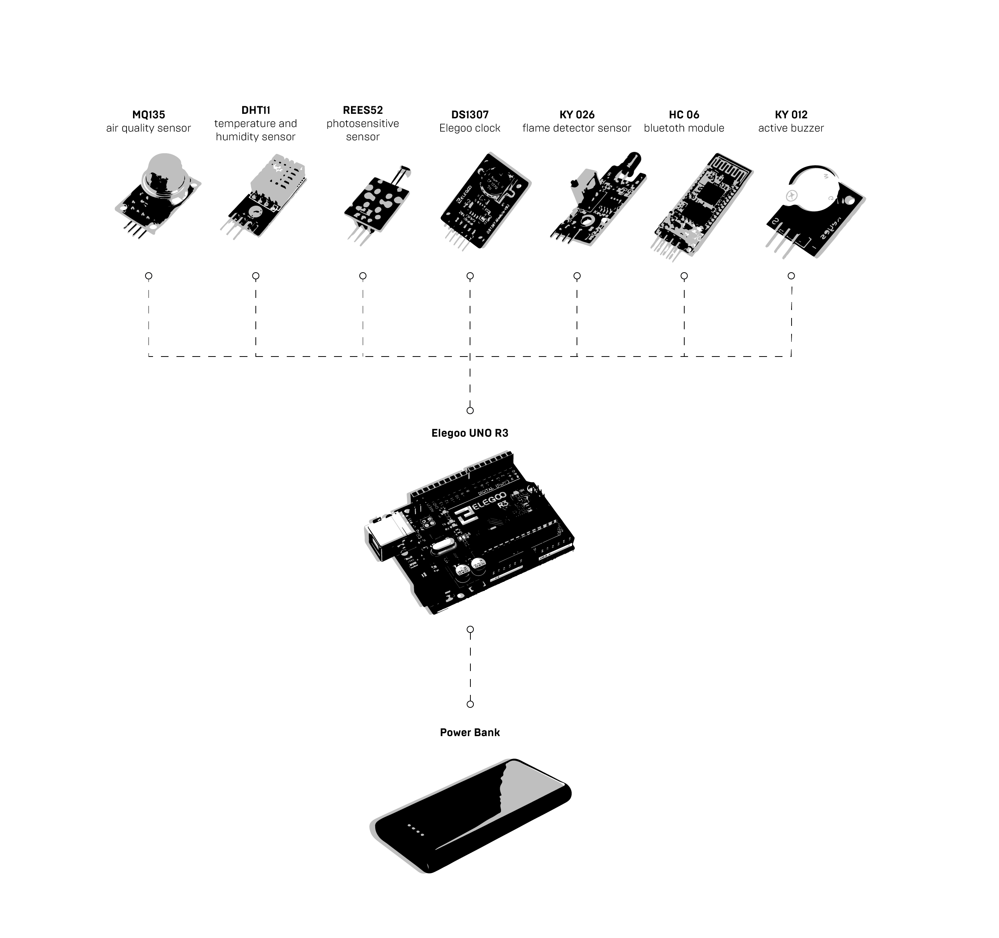

# ARDUINO
In this folder, you will find several libraries needed in order to run the example script that is also provided in the **Scripts** folder. The following shows the set of sensors as well as a schematic diagram. In addition we used three ultrasonic sensors in order to first test out the arduino script and the kind of data we were outputting. Once merging the arduino sensor box with the turtlebot, we were able to depend on the localization of the turtlebot.

